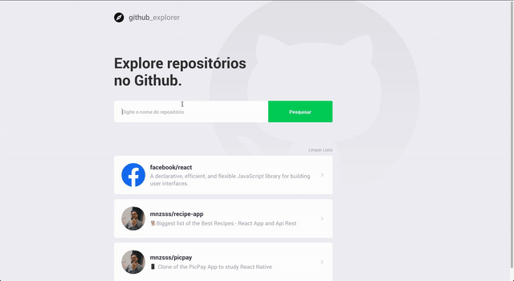

<h1 align="center">Welcome to Github Explorer 👋</h1>
<p align="center">
  
  <a href="#" target="_blank">
    
  </a>
</p>

<p align="center">📂Web Application show your do Github Repositories and Repository Issues, created at ReactJs and Typescript on Rocketseat Bootcamp GoStack
 </p>

### ✨ [Demo](https://codesandbox.io/s/github/mnzsss/github-explorer)

<p align="center">
 
 </p>

## Install

```sh
yarn
```

## Usage

```sh
yarn start
```

## Author

👤 **Gabriel Menezes**

- LinkedIn: [@mnzs](https://linkedin.com/in/mnzs)
- Github: [@mnzsss](https://github.com/mnzsss)

## Show your support

Give a ⭐️ if this project helped you!

---

_This README was generated with ❤️ by [readme-md-generator](https://github.com/kefranabg/readme-md-generator)_
